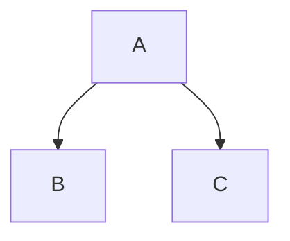

# Toys-of-control-theory

Play with "easy" nonlinear systems. 

<<<<<<< HEAD:Random Controllers/README.md

=======
Example 1 - underwater vehicle
- Dynamics:

>>>>>>> 4a2629554a710f622687c3294e7eab72a2f8314f:README.md
